# Fix Report #2: Images, Google Listing, Page Addresses and Chinese

taipeichurch.org  ·  September 27, 2026

Like Fix Report #1, these fixes were prepared on a local copy. The live website was not changed and no page layout changes. Each item says where to make the change in Wix.

| In this batch | Count |
|---|---|
| Image descriptions (alt text) | 47 images on 11 pages |
| Google business information | 1 wrong address, 2 settings |
| Page addresses to rename | 5 testimony pages |
| Chinese (Traditional) draft | Menu, Home, Families, Giving and Contact |
| Total time in Wix | About 1.5 hours, plus translation review |

## 1. Google business information (important)

**What we found:** the hidden business information that Wix sends to Google still has the old address: "No. 575, Mingshui Road, B2, Zhongshan District, Taipei City 10462" (postal code 10491). This can make Google Search and Google Maps show the old venue.

1. **Fix the address:** Wix Dashboard → Settings → Business Info → Location & contact info. Enter: B1, No. 41, Aly. 7, Ln. 397, Mingshui Rd., Zhongshan Dist., Taipei City 10466. Add info@taipeichurch.org and the service times.
1. **Google Business Profile:** if the church has a Google Maps listing, update the address there too (business.google.com).
1. **Structured data:** the site describes TIC to Google as a "LocalBusiness" named "taipeichurch". Change it to "Church" with the correct details. Wix Dashboard → Marketing & SEO → SEO Settings → Home page → Edit → Advanced SEO → Structured data markup. Replace the LocalBusiness markup with the code below, and in the "WebSite" markup change the name from "taipeichurch" to "Taipei International Church".

```json
{
  "@context": "https://schema.org",
  "@type": "Church",
  "name": "Taipei International Church",
  "alternateName": [
    "TIC",
    "台北國際教會"
  ],
  "url": "https://www.taipeichurch.org/",
  "logo": "https://static.wixstatic.com/media/8469c6_b97374b1c8c346af9672330333848dbb~mv2.png",
  "description": "A multicultural, multigenerational, English-speaking church in Dazhi, Taipei.",
  "email": "info@taipeichurch.org",
  "foundingDate": "1957",
  "address": {
    "@type": "PostalAddress",
    "streetAddress": "B1, No. 41, Aly. 7, Ln. 397, Mingshui Rd., Zhongshan Dist.",
    "addressLocality": "Taipei City",
    "postalCode": "10466",
    "addressCountry": "TW"
  },
  "geo": {
    "@type": "GeoCoordinates",
    "latitude": 25.0781275,
    "longitude": 121.5497606
  },
  "event": {
    "@type": "Event",
    "name": "Sunday Worship Service",
    "eventSchedule": {
      "@type": "Schedule",
      "byDay": "https://schema.org/Sunday",
      "startTime": "10:30",
      "repeatFrequency": "P1W",
      "scheduleTimezone": "Asia/Taipei"
    },
    "location": {
      "@type": "Place",
      "name": "TIC Worship Center, B1",
      "address": "B1, No. 41, Aly. 7, Ln. 397, Mingshui Rd., Zhongshan Dist., Taipei City 10466"
    },
    "organizer": {
      "@type": "Church",
      "name": "Taipei International Church"
    }
  },
  "sameAs": [
    "https://www.youtube.com/channel/UCb_DF4LVCX5aLkdkOqmkyjA",
    "https://www.facebook.com/Taipei.Intl.Church/",
    "https://www.instagram.com/tic_taipeichurch/",
    "https://twitter.com/TIConlinechurch",
    "https://open.spotify.com/show/6KYo14ZcT2LvSujbNx273A"
  ]
}
```

## 2. Page addresses that do not match their content

Five testimony pages were made by copying another page, and Wix kept the old address. Every one of them now shows a different person than its address says. In Wix: Pages menu → the page's ⋯ → SEO basics → URL slug. Change the slug and keep "Create a 301 redirect" turned on, so old links still work.

| Current address | Page shows | New address |
|---|---|---|
| /copy-of-testimony-ange-samuel | Deborah Kay | /testimony-deborah-kay |
| /copy-of-testimony-matt-and-liz-west | Vivian Hu | /testimony-vivian-hu |
| /copy-of-testimony-ps-peter | Woody and Alita Wang | /testimony-woody-and-alita-wang |
| /copy-of-testimony-vivian-hu | Ange Samuel | /testimony-ange-samuel |
| /copy-of-testimony-woody-and-alita-w | Matt and Liz West | /testimony-matt-and-liz-west |

The five new addresses are not in use on the site today. Rename in this order to avoid clashes: first all five to their new names, then check the testimony links on Serve and What's Happening.

## 3. Image descriptions (alt text)

Alt text is read aloud to blind visitors and helps Google understand the photos. In the Wix Editor: click the image → Settings (gear) → "What's in the image? Tell Google" → paste the text. For a gallery: Manage Media → click the photo → Alt text. Descriptions avoid naming people so they stay correct.

| Photo | Page | Alt text to paste |
|---|---|---|
| 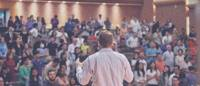 | about-us | Pastor preaching to a full congregation at Taipei International Church |
|  | about-us | Hands raised in worship over a colorful painted sky |
|  | beliefs, vision | Worshippers sharing communion during a Sunday service |
| 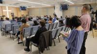 | constitution | Congregation seated in the TIC Worship Center during a service |
|  | families | Friends smiling together at a church Christmas meal |
| 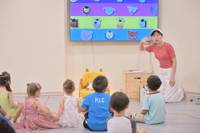 | families | Preschool children listening to their teacher in TIC Kids |
| 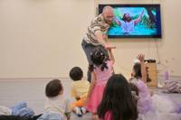 | families | Kids worshipping with a teacher in the TIC Kids room |
| 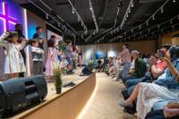 | families | Children singing on stage in front of the congregation |
|  | groups | Two women reading the Bible together in a small group |
|  | home | Taipei city skyline with Taipei 101 and the mountains at sunset |
| 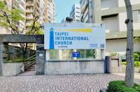 | home | Entrance to the TIC Worship Center with the Taipei International Church sign |
| 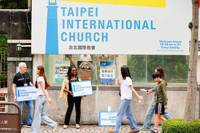 | home | Church members welcoming people outside under the Taipei International Church sign |
| 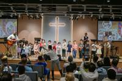 | home | Children singing on stage under the lit cross during Sunday worship |
| 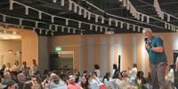 | meettheteam | Speaker with a microphone addressing the congregation |
| 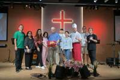 | meettheteam | TIC team members standing together on stage in front of the red cross |
| 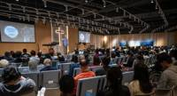 | meettheteam | Wide view of a Sunday service in the TIC Worship Center |
| 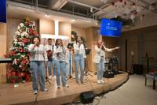 | serve | Worship team singing at the Christmas service |
|  | serve | Worship team members posing together at Christmas |
| 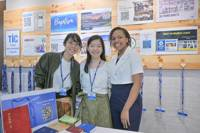 | serve | Welcome team volunteers at the TIC welcome table |
| 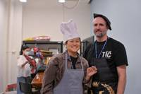 | serve | Hospitality volunteers in aprons and a chef hat |
| 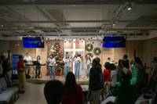 | serve | Christmas service on stage in the TIC Worship Center |
| 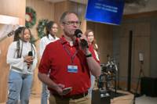 | serve | Worship leader singing with the team at Christmas |
| 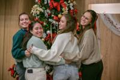 | serve | Friends hugging in front of the Christmas tree |
| 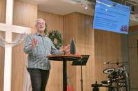 | serve | Pastor speaking from the pulpit at the Christmas service |
| 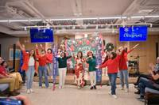 | serve | Dancers performing during the Christmas celebration |
| 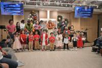 | serve | Children and teachers singing together at the Christmas service |
| 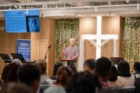 | serve | Pastor speaking to the congregation with the vision statement on screen |
| 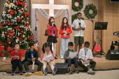 | serve | Children reading their lines at the Christmas program |
| 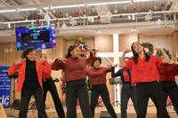 | serve | Dancers performing at the Lights of Christmas celebration |
| 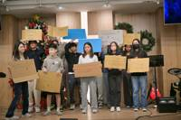 | serve | Youth holding cardboard testimony signs on stage |
|  | serve | Church members sharing a meal at a Christmas dinner |
| 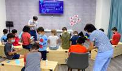 | serve | Children doing a craft activity in the TIC Kids room |
|  | vision | Taipei city skyline with Taipei 101 |
| (image could not be loaded) | vision | Photo on the Vision page |
|  | vision | Man holding a cardboard testimony sign reading Accepted, Wanted, Joyful |
| 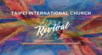 | whatshappening | Revival banner: join us for worship at 10:30 am at the TIC Worship Center in Dazhi |
| 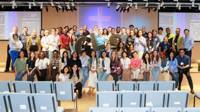 | whatshappening | Group photo of participants in the TIC Worship Center |
| 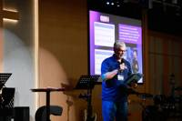 | whatshappening | Speaker presenting at a leadership event at TIC |
|  | whatshappening | Participants laughing together during a session |
|  | whatshappening | Volunteers preparing materials at the registration table |
|  | whatshappening | Participants talking together in small groups |
|  | whatshappening | Participants in discussion during a group session |
|  | whatshappening | Audience watching a video session in the TIC Worship Center |
| 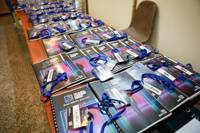 | whatshappening | Event name badges and booklets laid out on a table |
| 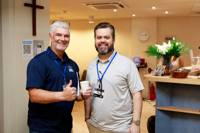 | whatshappening | Two event hosts smiling in the TIC lobby |

One image on the Vision page could not be loaded for review; its description is a placeholder. Please check it in the editor.

## 4. Traditional Chinese draft (繁體中文)

**Draft for review.** This is a first translation to load into Wix Multilingual after adding Chinese (Traditional, Taiwan) as a second language. English stays the main language. A native speaker should review it before it goes live. Times marked * depend on decisions in Fix Report #1.

### Menu

| English | 中文 |
|---|---|
| Home | 首頁 |
| About Us | 關於我們 |
| Beliefs | 我們的信仰 |
| Vision, Mission & Values | 異象、使命與價值 |
| History & Constitution | 歷史與章程 |
| Meet the Team | 認識我們的團隊 |
| Stories | 生命見證 |
| What's Happening | 最新消息 |
| Calendar | 行事曆 |
| Families | 家庭事工 |
| Giving | 奉獻 |
| Connect | 連結 |
| Groups | 小組 |
| Serve | 服事 |
| Contact | 聯絡我們 |
| Events | 活動 |
| Log In | 登入 |

### Home page

| English | 中文 |
|---|---|
| Welcome to Taipei International Church | 歡迎來到台北國際教會 |
| Sunday Worship Service at 10:30 AM in Dazhi | 主日崇拜：上午10:30，大直 |
| Online Service \| 11:00AM | 線上崇拜｜上午11:00 |
| Newsletter Sign Up | 訂閱電子報 |
| Map | 地圖 |
| TIC is a multicultural, multigenerational, English speaking Church, filled with the power of the Holy Spirit. | 台北國際教會是一間多元文化、跨世代、以英語聚會的教會，充滿聖靈的能力。 |
| We proclaim the good news in word and action and bring glory to God in all we do. | 我們以言語和行動傳揚福音，凡事榮耀神。 |
| TIC New Home — We've moved to our new home! | 台北國際教會新家——我們搬到新家了！ |
| We are excited to share that we have officially moved into our new venue. We look forward to welcoming everyone into our warm and beautiful space where we can worship and continue growing together in faith and fellowship. See the map below for details on our new location! | 我們很高興宣布，教會已正式遷入新的聚會場所。我們期待在這個溫暖又美麗的空間迎接每一位，一同敬拜，並在信仰與團契中持續成長。新地點的詳細資訊請參考下方地圖！ |
| About the Church — Learn More | 認識教會——了解更多 |
| Stories. My life changed at TIC — Listen Now | 生命見證：我在台北國際教會的改變——立即收聽 |
| Connect — Meet new friends | 連結——認識新朋友 |
| Messages. Every Sunday | 講道信息：每主日 |
| Serve — Opportunities | 服事機會 |
| Quick Links / Follow Us | 快速連結／追蹤我們 |
| You Belong Here | 這裡就是你的家 |
| We are gathering in our home in B1 at TIC Worship Center in Dazhi. | 我們在大直的台北國際教會敬拜中心B1聚會。 |
| No. 41, Aly. 7, Ln. 397, Mingshui Rd., Zhongshan Dist., Taipei City 10466 | 10466台北市中山區明水路397巷7弄41號B1 |
| Sunday Walk Guide | 主日步行指南 |
| Our Leaders | 教會同工 |
| Our pastoral staff, administrative staff and elders are a warm group of people who love God, love people and love life! | 我們的牧養同工、行政同工與長老，是一群愛神、愛人、熱愛生命的溫暖團隊！ |
| Sermons — Watch Now | 講道——立即觀看 |
| My Prayer Request — Share | 我的代禱事項——送出 |
| Share Praise — Share | 分享感恩——送出 |

### Families page

| English | 中文 |
|---|---|
| On Sundays, families stay together during the singing portion of the service, then children from Pre-K to 12th grade are dismissed. | 主日崇拜的詩歌敬拜時間，全家一起敬拜；之後，學前班至12年級的孩子會前往各自的聚會。 |
| Nursery — Infants and Toddlers | 育嬰室——嬰幼兒 |
| Infants and toddlers may be checked in to the nursery to be cared for during the 10:30 a.m. worship service. | 上午10:30崇拜期間，嬰幼兒可以登記進入育嬰室，由同工照顧。 |
| Kids — Pre-school to 5th Grade | 兒童主日學——學前班至五年級 |
| Children (Pre-K to 5th grade) are dismissed from the main service and checked into TIC Kids from 11:20 a.m. to noon. Kids worship together, listen to teaching from the Bible, and break up into small groups by grade level to review the lesson and do an activity related to the lesson. | 學前班至五年級的孩子會在上午11:20離開主堂，報到參加TIC Kids，至中午12:00結束。孩子們一起敬拜、聆聽聖經教導，並依年級分成小組複習課程、進行相關活動。 |
| Each child must be checked in and out by a parent or authorized adult. | 每位孩子都必須由家長或授權的成人辦理報到及接回。 |
| Youth Service. Being a disciple is God's plan for every youth. Are you a teenager? Would you love to have fun while being discipled? Yay! Join us every Sunday at TIC at 11:00am.* | 青少年聚會。成為門徒是神為每位青少年預備的計畫。你是青少年嗎？想在歡樂中被門訓嗎？太好了！每主日上午11:00*歡迎來台北國際教會和我們一起！ |

### Giving and Contact

| English | 中文 |
|---|---|
| Giving | 奉獻 |
| Credit card (online) | 信用卡線上奉獻 |
| Domestic bank transfer (TWD) | 國內台幣轉帳 |
| Overseas wire transfer | 海外匯款 |
| Contact Us | 聯絡我們 |
| Taipei International Church Office | 台北國際教會辦公室 |
| Ask TIC! | 有問題嗎？問問我們！ |
| Submit | 送出 |
| Thanks for submitting! | 感謝您的來信！ |

Next batch: Groups, Serve, About, Beliefs, Vision and History.

